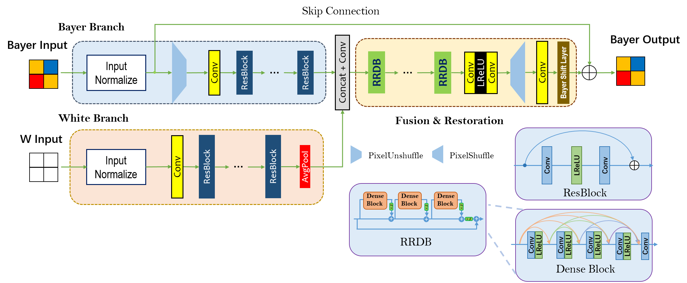
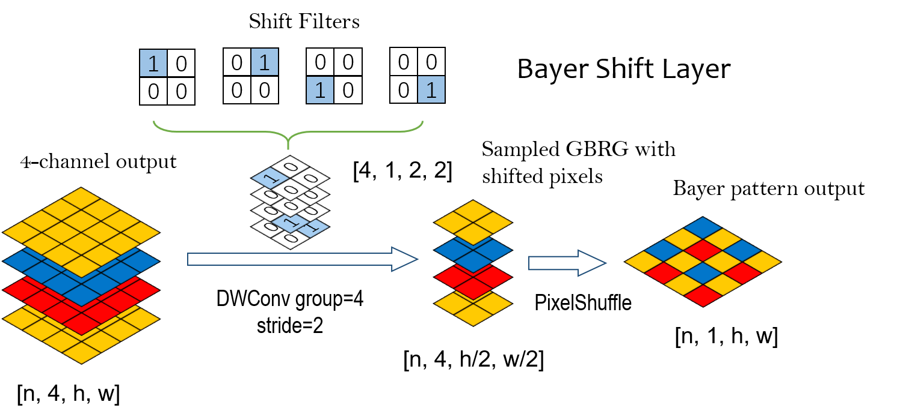
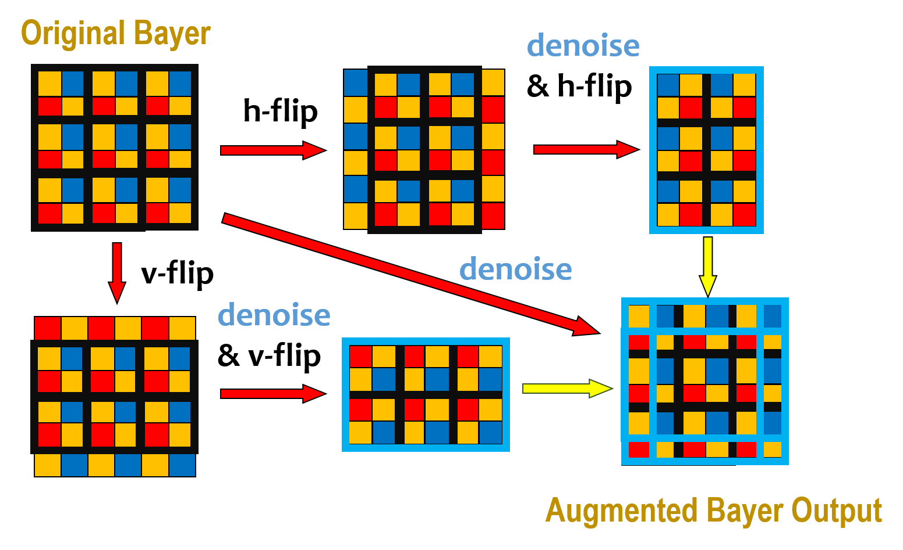

# Dual Branch Network for RGBW Fusion and Denoising (Official Implementation)

This is the **top 3rd** solution for RGBW fusion and denoising challenge of MIPI 2022 (team jzsherlock).

[Mobile Intelligent Photography and Imaging Challenge (MIPI) 2022](https://mipi-challenge.org/)

Challenge report: [RGBW Joint Fusion and Denoise @MIPI-challenge](https://arxiv.org/abs/2209.07530)

## Method Description
We proposed a dual-branch network to restore the noisy bayer image with the guidance of corresponding white image. The architecture of the network is shown in Fig.1. The bayer branch takes normalized noisy bayer image as input and output the denoised result. As the bayer image has the repeated pattern of size 2x2, so we first convert the bayer image to GBRG channels by pixel unshuffle operation with scale=2, then the feature maps of noisy bayer image is extracted using stacked ResBlocks which have no BN layers. The other white branch extracts the features from corresponding white image using stacked ResBlocks, and an average pooling layer follows to rescale the white image features to the same size as bayer branch for feature fusion. After the features from two branches fused together, several Residual-in-Residual Dense Blocks (RRDB) are utilized for the restoration. After the RRDB blocks, a Conv+LeakyReLU+Conv structure is applied to enlarge the feature map channels by scale of 4 (from [n, c, h/2, w/2] to [n, 4c, h/2, w/2], where n, c, h, w represent batchsize, feature map channels, and bayer input height and width respectively). Then pixel shuffle with scale=2 is applied to the feature maps to upscale the feature maps to the input size in height and width dimension (from [n, 4c, h/2, w/2] to [n, c, h, w]). After the pixel shuffle operation, a Conv layer is used to convert the [n, c, h, w] to [n, 4, h, w] to simulate the GBRG 4 channels. At last, a bayer shift layer is used to get the bayer pattern image with shape [n, 1, h, w], which then added the input bayer from skip connection to form the final denoised result. 



The operations inside bayer shift layer is illustrated in Fig.2 . We do not output the bayer pattern result using a simple pixel shuffle layer, because the pixels of each 2x2 GBRG cell are from different locations, but the values in each channels from a pixel in feature maps are aligned. So we simulate the subsampling operation from a complete GBRG 4-channel image to get the unaligned pixels, and fuse them by placing each color in the corresponding location using GBRG format. This process is implemented using depth-wise convolution (DWConv) and pixel shuffle for assurance of back propagation. Firstly, we form the locations in 2x2 cell as shift filters, and apply a DWConv with stacked shift filters as kernel and stride=2. Then the 4 channels are subsampled according to their correct shift, and converted to 1 channel via pixel shuffle. 



The network is trained using L1 loss in the normalized domain. The final selected input normalize method is min-max normalize with min=64 and max=1023, with values out of the range clipped. Details of training and inference will be described in the following section.

TTA (Test Time Augmentation) is used in inference time with some modification to the common implementations due to the non-symmetric property of bayer pattern. As shown in Fig. 3, after the horizontal flip (h-flip), the GBRG pattern turns into BGGR, which cannot feed into the network for prediction. However, considering the periodic property of bayer pattern, we clip the first and last column, then the left pixels form a GBRG pattern again, which can be used as the input of bayer branch of the network. Similar operation is done for vertical flip (v-flip). Finally the overlapped regions in outputs from original bayer, h-flipped bayer and v-flipped bayer are averaged to form the augmented result.



## Brief Summary of Codebase

This codebase contains a `BasicSR` folder which is modified from the original [BasicSR](https://github.com/XPixelGroup/BasicSR) project. This codebase is mainly based on BasicSR framework. Folder `codebase` contains the necessary source code to re-run the training and inference code, including the archs of network, training settings and configures, and other utiliy codes. `experiments` is the place for final model and corresponding .log file which can be checked. The `requirements.txt` contains the possible required packages to be installed and their versions. Note that the precise versions given here means they are tested and can work well, packages with similar but not the same version may work well too if you cannot install the same version.

## Installation and Preparation

First, install the required packages in `requirements.txt` by:

```shell
pip install -r requirements.txt
```

Then install BasicSR from the local `BasicSR` folder, using command:

```shell
cd BasicSR
python setup.py develop
```

note that the BasicSR must be installed using the local source code, instead of using pip or original github source, because there are some modifications made in the local version. 

After the installation, please assure the torch and basicsr can be normally imported in python, and torch can use cuda. Then you can re-implement the result given in `experiments` folder.

## Re-run Training or Inference

In order to re-implement the training, you can use the `start_train.sh` with the arguments for config (.yml format) and gpu id:
(need to modify the .yml in `option/train` to make the dataroot comply with your dataset location)

```shell
cd codebase
sh start_train.sh options/train/012_clipnorm_bslndualv2_nobn_bs32ps160_msteplr_l1loss_trainall.yml 0  # re-run the config for final model in GPU 0
```

to inference for the test dataset with the final model without training (or after training), run the following command (modify test .yml dataroot as stated above):

```shell
python test_rgbw.py -opt options/test/finaltest_012_clipnorm_bslndualv2_nobn_bs32ps160_msteplr_l1loss_trainall_tta.yml
```

The processed results are saved `results` folder in the parent dir of `codebase`. in the subfolder with the name same as written in the final test configure: `012_clipnorm_bslndualv2_nobn_bs32ps160_msteplr_l1loss_trainall`.


## Citation

Please **star** the repository if this codebase helps you. If you would like to use this code for official purpose, a formal citation form is provided as below:

```
@software{rgbw_jzsherlock_2022,
  author = {Zhuang Jia},
  month = {11},
  title = {{Dual Branch Network for RGBW Fusion and Denoising}},
  url = {https://github.com/jzsherlock4869/RGBW-fusion-denoise},
  version = {1.0.0},
  year = {2023}
}
```

